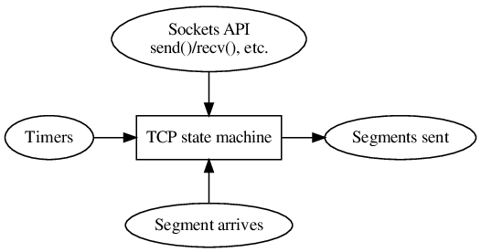

# Shuo Chen's notes on Linux TCP/IP stack

Source of this site: <https://github.com/chenshuo/tcpip-study>

The TCP state machine has three

## TCP/IP Reference

_TCP/IP Illustrated (vol. 1): The Protocols, 2nd ed._ by [Kevin R. Fall](http://kfall.com/) and [W. Richard Stevens](http://www.kohala.com/start/), 2011/11.

* [RFC793](https://tools.ietf.org/html/rfc793) Transmission Control Protocol, 1981/09
* [RFC896](https://tools.ietf.org/html/rfc896) Nagle algorithm, 1984/01.
  [Minshall's update](https://tools.ietf.org/html/draft-minshall-nagle-00).
* [RFC1122](https://tools.ietf.org/html/rfc1122) Requirements for Internet Hosts --- Communication Layers, 1989/10
* [RFC5681](https://tools.ietf.org/html/rfc5681) TCP Congestion Control, 2009/09
* [RFC6093](https://tools.ietf.org/html/rfc6093) On the Implementation of the TCP Urgent Mechanism, 2011/01,
  which recommends against the use of urgent mechanism.
* [RFC7323](https://tools.ietf.org/html/rfc7323) TCP Extensions for High Performance, obsoletes [RFC1323](https://tools.ietf.org/html/rfc1323)
* [RFC7413](https://tools.ietf.org/html/rfc7414) TCP Fast Open
* [RFC7414](https://tools.ietf.org/html/rfc7414) TCP Roadmap
* [RFC8312](https://tools.ietf.org/html/rfc8312) [CUBIC](https://en.wikipedia.org/wiki/CUBIC_TCP),
  Linux's default [congestion control algorithm](https://en.wikipedia.org/wiki/TCP_congestion_control) since 2.6.19,
  replaced [BIC](https://en.wikipedia.org/wiki/BIC_TCP) (default from 2.6.8 till 2.6.18.x)
* Many others

## TCP/IP Implementations

* BSD family, [BSD family tree](https://svnweb.freebsd.org/base/head/share/misc/bsd-family-tree?view=markup)
   
 
    * 4.4BSD-Lite is convered in _TCP/IP Illustrated (vol. 2): The Implementation_ by
      Gary R. Wright and W. Richard Stevens, 1995.
    * FreeBSD
    * <http://www.f-stack.org/> User space TCP/IP stack from FreeBSD 11.0
* Linux
    * First in 0.98?
    * <https://blog.cloudflare.com/why-we-use-the-linux-kernels-tcp-stack/>
    * <https://jvns.ca/blog/2016/06/30/why-do-we-use-the-linux-kernels-tcp-stack/>
* lwIP / uIP / [picoTCP](https://github.com/tass-belgium/picotcp)
    * For microcontrollers, small footprint
* gvisor / [netstack](https://github.com/google/gvisor/tree/master/pkg/tcpip)
    * User space, in Golang
* Others, mostly user space
    * <https://shader.kaist.edu/mtcp/>
    * <http://seastar.io/networking/>
* Educational OSes
    * Minix [2.x](https://github.com/chenshuo/old-minix/tree/master/src/inet), 3.x uses lwIP.
    * Xinu [code](ftp://ftp.cs.purdue.edu/pub/comer/TCPIP-vol2.dist.tar.gz),
      covered in _Internetworking With TCP/IP Volume II: Design, Implementation, and Internals, 3rd ed._ by
      [Douglas E. Comer](https://www.cs.purdue.edu/homes/comer/netbooks.html) and David L. Stevens, 1999.
* Toy implementations
    * <https://github.com/saminiir/level-ip>

## Tools

* [packetdrill](https://github.com/google/packetdrill) is a unittest for entire TCP/IP stack.
* [neper](https://github.com/google/neper) is a performance testing tool to generate workloads.

## Recent changes

Recent changes that I am aware of.

* **EDT** [netdev](https://netdevconf.info/) [0x12](https://netdevconf.info/0x12/) [Keynote](https://netdevconf.info/0x12/session.html?evolving-from-afap-teaching-nics-about-time):
  Evolving from AFAP: Teaching NICs about time by [Van Jacobson](https://en.wikipedia.org/wiki/Van_Jacobson),
  [slides](https://www.files.netdevconf.info/d/4ee0a09788fe49709855/) and [video](https://youtu.be/MAni0_lN7zE).
    * [Linux 4.20](https://kernelnewbies.org/Linux_4.20#TCP:_switch_to_Early_Departure_Time_model) [switched](https://lwn.net/ml/netdev/20180921155154.49489-1-edumazet@google.com/) to
      Early Departure Time model in 2018/09, and [refined](https://lwn.net/ml/netdev/20181015163758.232436-1-edumazet@google.com/) in 2018/10.

## Historical notes

In 2004, [Vinton Cerf](https://en.wikipedia.org/wiki/Vint_Cerf) and [Robert Kahn](https://en.wikipedia.org/wiki/Bob_Kahn) received the ACM Turing Award for their foundational work on TCP/IP.
[A Protocol for Packet Network Intercommunication](https://www.cs.princeton.edu/courses/archive/fall06/cos561/papers/cerf74.pdf), May 1974.
