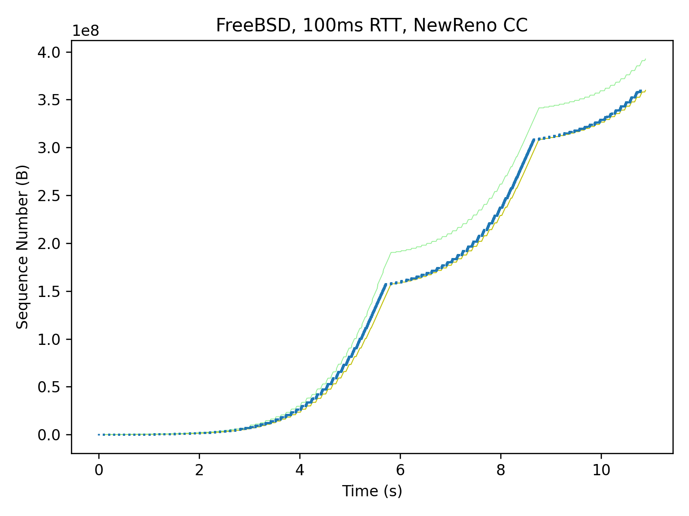
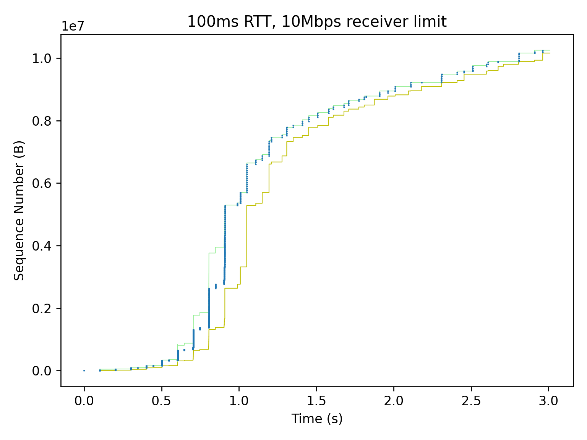

# TCP Throughput

TCP Throughput <= Bytes in flight / RTT, where RTT = round-trip time.
Max bytes in flight = min(Cwnd, Rwnd, sndbuf, BDP).

## TCP trace segment graph

`tcptrace` is a tool written by [Shawn Ostermann](http://oucsace.cs.ohio.edu/~osterman/) at Ohio University, http://tcptrace.org. Wireshark can produce nice interactive graphs.



Here we show FreeBSD's NewReno congestion control, slow start after packet loss.


## Mininet

All graphs below are from Linux using CUBIC cc, running under [Mininet](http://mininet.org).

```
mininet> net
h1 h1-eth0:s1-eth1
h2 h2-eth0:s1-eth2
s1 lo:  s1-eth1:h1-eth0 s1-eth2:h2-eth0
```


Packets are captured at sender side `tcpdump -i s1-eth1 -s 128`.

```
mininet> h1 ping -c 4 h2
PING 10.0.0.2 (10.0.0.2) 56(84) bytes of data.
64 bytes from 10.0.0.2: icmp_seq=1 ttl=64 time=0.252 ms
64 bytes from 10.0.0.2: icmp_seq=2 ttl=64 time=0.053 ms
64 bytes from 10.0.0.2: icmp_seq=3 ttl=64 time=0.059 ms
64 bytes from 10.0.0.2: icmp_seq=4 ttl=64 time=0.056 ms
```

```
mininet> xterm h2  # then start `iperf3 -s` on h2

mininet> h1 iperf3 -c h2
Connecting to host 10.0.0.2, port 5201
[  5] local 10.0.0.1 port 37680 connected to 10.0.0.2 port 5201
[ ID] Interval           Transfer     Bitrate         Retr  Cwnd
[  5]   0.00-1.00   sec  8.00 GBytes  68.7 Gbits/sec    0    666 KBytes
[  5]   1.00-2.00   sec  8.20 GBytes  70.4 Gbits/sec    0    940 KBytes
[  5]   2.00-3.00   sec  7.89 GBytes  67.7 Gbits/sec    0   1.15 MBytes
[  5]   3.00-4.00   sec  7.90 GBytes  67.9 Gbits/sec    0   1.28 MBytes
[  5]   4.00-5.00   sec  7.98 GBytes  68.6 Gbits/sec    0   1.42 MBytes
[  5]   5.00-6.00   sec  8.16 GBytes  70.1 Gbits/sec    0   1.70 MBytes
[  5]   6.00-7.00   sec  8.17 GBytes  70.2 Gbits/sec    0   1.70 MBytes
[  5]   7.00-8.00   sec  8.14 GBytes  69.9 Gbits/sec    0   1.79 MBytes
[  5]   8.00-9.00   sec  8.04 GBytes  69.0 Gbits/sec    0   1.79 MBytes
[  5]   9.00-10.00  sec  7.99 GBytes  68.7 Gbits/sec    0   1.88 MBytes
- - - - - - - - - - - - - - - - - - - - - - - - -
[ ID] Interval           Transfer     Bitrate         Retr
[  5]   0.00-10.00  sec  80.5 GBytes  69.1 Gbits/sec    0             sender
[  5]   0.00-10.00  sec  80.5 GBytes  69.1 Gbits/sec                  receiver

iperf Done.
```

Add 100ms latency using `netem delay 100ms`.

```
mininet> s1 tc qdisc replace dev s1-eth2 root netem delay 100ms

mininet> h1 ping -c 4 h2
PING 10.0.0.2 (10.0.0.2) 56(84) bytes of data.
64 bytes from 10.0.0.2: icmp_seq=1 ttl=64 time=101 ms
64 bytes from 10.0.0.2: icmp_seq=2 ttl=64 time=100 ms
64 bytes from 10.0.0.2: icmp_seq=3 ttl=64 time=100 ms
64 bytes from 10.0.0.2: icmp_seq=4 ttl=64 time=100 ms
```

## Slow sender

`iperf3 -c server --bitrate 10M`


## Slow sender using FQ pacing

`iperf3 -c server --fq-rate 10M`


No bursts.

## Slow receiver

`iperf3 -s --server-bitrate-limit 10M`



Small window size.

## Small Rwnd

```
mininet> h1 bin/tcpperf -c h2
Connected 10.0.0.1:37662 -> 10.0.0.2:2009, congestion control: cubic
Time (s)  Throughput   Bitrate    Cwnd    Rwnd  sndbuf  ssthresh  rtt/var
  0.000s   0.00kB/s   0.00kbps  14.1Ki  42.4Ki  85.3Ki    2048Mi  201.2ms/100593
  1.048s   21.0MB/s    168Mbps  10.5Mi  6094Ki  16.0Mi    2048Mi  100.2ms/56  retrans=3
  2.050s   65.2MB/s    522Mbps  16.5Mi  6518Ki  16.0Mi    2048Mi  100.4ms/107
  3.054s   66.6MB/s    533Mbps  16.5Mi  6546Ki  16.0Mi    2048Mi  100.4ms/80
  4.058s   66.7MB/s    534Mbps  16.5Mi  6520Ki  16.0Mi    2048Mi  100.5ms/61
  5.063s   66.7MB/s    533Mbps  16.5Mi  6546Ki  16.0Mi    2048Mi  100.5ms/80
  6.066s   66.8MB/s    534Mbps  16.5Mi  6520Ki  16.0Mi    2048Mi  100.4ms/81
  7.070s   66.6MB/s    533Mbps  16.5Mi  6546Ki  16.0Mi    2048Mi  100.4ms/69
  8.074s   66.8MB/s    534Mbps  16.5Mi  6520Ki  16.0Mi    2048Mi  100.4ms/68
  9.077s   66.9MB/s    535Mbps  16.5Mi  6552Ki  16.0Mi    2048Mi  100.3ms/77
 10.081s   66.7MB/s    534Mbps  16.5Mi  6548Ki  16.0Mi    2048Mi  100.4ms/115
Transferred 623MBytes in 10.238s, 4754 syscalls, 131072.0 Bytes/syscall
```

Throughput is limited by Rwnd (`snd_wnd`), 100ms * 66.7MB/s = 6.5MB.


Window is filled up as soon as advertised.

Set larger `tcp_rmem` on receiver, for larger Rwnd.

```
mininet> h2 sysctl -A |grep tcp_.mem
net.ipv4.tcp_rmem = 10240	87380	16777216
net.ipv4.tcp_wmem = 10240	87380	16777216
mininet> h2 sysctl -A |grep tcp_adv
net.ipv4.tcp_adv_win_scale = 1
mininet> h2 sysctl -w net.ipv4.tcp_rmem="10240 131072 65536000"
net.ipv4.tcp_rmem = 10240 131072 65536000
```

For `net.ipv4.tcp_adv_win_scale = 1`, `Rwnd = tcp_rmem[2] / 2 = 32MB`.


## Small sndbuf

```
mininet> h1 bin/tcpperf -c h2
Connected 10.0.0.1:45092 -> 10.0.0.2:2009, congestion control: cubic
Time (s)  Throughput   Bitrate    Cwnd    Rwnd  sndbuf  ssthresh  rtt/var
  0.000s   0.00kB/s   0.00kbps  14.1Ki  42.4Ki  85.3Ki    2048Mi  100.7ms/50326
  1.045s   18.3MB/s    147Mbps  10.2Mi  8474Ki  16.0Mi    2048Mi  103.6ms/6137  retrans=2
  2.034s    148MB/s   1184Mbps  31.4Mi  31.2Mi  16.0Mi    2048Mi  100.0ms/20
  3.014s    159MB/s   1272Mbps  31.4Mi  31.2Mi  16.0Mi    2048Mi  100.0ms/1
  4.005s    157MB/s   1255Mbps  31.4Mi  31.2Mi  16.0Mi    2048Mi  100.0ms/5
  5.042s    158MB/s   1264Mbps  31.4Mi  31.2Mi  16.0Mi    2048Mi  100.0ms/16
  6.020s    159MB/s   1275Mbps  31.4Mi  31.2Mi  16.0Mi    2048Mi  100.0ms/15
  7.016s    154MB/s   1229Mbps  31.4Mi  31.2Mi  16.0Mi    2048Mi  100.0ms/2
  8.055s    158MB/s   1261Mbps  31.4Mi  31.2Mi  16.0Mi    2048Mi  100.0ms/0
  9.019s    164MB/s   1314Mbps  31.4Mi  31.2Mi  16.0Mi    2048Mi  100.0ms/15
 10.034s    151MB/s   1206Mbps  31.4Mi  31.2Mi  16.0Mi    2048Mi  100.0ms/14
Transferred 1425MBytes in 10.134s, 10869 syscalls, 131072.0 Bytes/syscall
```

Throughput is limited by sndbuf, 100ms * 160MB/s = 16MB.


Rwnd is only half filled, in a burst.

Higher throughput achived by larger `sndbuf`.

```
mininet> h1 sysctl -w net.ipv4.tcp_wmem="10240 131072 65536000"
net.ipv4.tcp_wmem = 10240 131072 65536000

mininet> h1 bin/tcpperf -c h2
Connected 10.0.0.1:53176 -> 10.0.0.2:2009, congestion control: cubic
Time (s)  Throughput   Bitrate    Cwnd    Rwnd  sndbuf  ssthresh  rtt/var
  0.000s   0.00kB/s   0.00kbps  14.1Ki  42.4Ki   128Ki    2048Mi  100.4ms/50205
  1.004s   32.1MB/s    257Mbps  7767Ki  11.0Mi  37.8Mi    2048Mi  100.5ms/47
  2.051s    249MB/s   1995Mbps  68.3Mi  24.9Mi  62.5Mi    2048Mi  100.7ms/134  retrans=585
  3.056s    260MB/s   2081Mbps  68.3Mi  24.9Mi  62.5Mi    2048Mi  100.6ms/147
  4.061s    260MB/s   2082Mbps  68.3Mi  21.9Mi  62.5Mi    2048Mi  100.5ms/23
  5.024s    274MB/s   2194Mbps  68.3Mi  24.3Mi  62.5Mi    2048Mi  100.2ms/64
  6.028s    313MB/s   2500Mbps  68.3Mi  26.4Mi  62.5Mi    2048Mi  100.1ms/58
  7.034s    325MB/s   2603Mbps  68.3Mi  29.6Mi  62.5Mi    2048Mi  100.1ms/73
  8.040s    325MB/s   2602Mbps  68.3Mi  28.9Mi  62.5Mi    2048Mi  100.1ms/40
  9.046s    326MB/s   2604Mbps  68.3Mi  29.7Mi  62.5Mi    2048Mi  100.2ms/112
 10.051s    325MB/s   2603Mbps  68.3Mi  27.9Mi  62.5Mi    2048Mi  100.1ms/100
Transferred 2703MBytes in 10.154s, 20625 syscalls, 131072.0 Bytes/syscall
```

## Small Cwnd

Congestion control algorithms decide congestion window (Cwnd).

With RTT = 100ms, FreeBSD newreno CC sometimes increases Cwnd slowly.


In the following example, reaches max bandwidth after ~30 seconds.

```
freebsd:~/recipes/tpc % bin/tcpperf -c 172.16.0.59 -b 100G -t 30
Connected 172.16.0.77:31839 -> 172.16.0.59:2009, congestion control: newreno
Time (s)  Throughput   Bitrate    Cwnd    Rwnd  sndbuf  ssthresh  rtt/var
  0.000s   0.00kB/s   0.00kbps  14.1Ki  63.6Ki  32.8Ki    1024Mi  202.0ms/101000
  1.104s    356kB/s   2849kbps  45.5Ki   435Ki  96.8Ki    1024Mi  123.8ms/42562
  2.007s    580kB/s   4643kbps  71.2Ki   589Ki   137Ki    1024Mi  107.5ms/13937
  3.010s    915kB/s   7318kbps  99.7Ki   593Ki   201Ki    1024Mi  102.3ms/3750
  4.014s   1176kB/s   9404kbps   128Ki   593Ki   257Ki    1024Mi  100.9ms/1187
  5.017s   1437kB/s   11.5Mbps   162Ki  1307Ki   321Ki    1024Mi  100.5ms/687
  6.021s   1829kB/s   14.6Mbps   191Ki  1307Ki   377Ki    1024Mi  100.4ms/562
  7.024s   2090kB/s   16.7Mbps   219Ki  1287Ki   441Ki    1024Mi  100.4ms/687
  8.028s   2481kB/s   19.9Mbps   248Ki  1266Ki   497Ki    1024Mi  100.5ms/687
  9.032s   2611kB/s   20.9Mbps   276Ki  1246Ki   553Ki    1024Mi  100.5ms/750
 10.035s   3005kB/s   24.0Mbps   311Ki  1820Ki   617Ki    1024Mi  100.4ms/500
 11.038s   3396kB/s   27.2Mbps   339Ki  1894Ki   681Ki    1024Mi  100.4ms/500
 12.042s   3526kB/s   28.2Mbps   368Ki  1919Ki   737Ki    1024Mi  100.5ms/625
 13.047s   4045kB/s   32.4Mbps   418Ki  1852Ki   857Ki    1024Mi  101.2ms/1375
 14.050s   4701kB/s   37.6Mbps   480Ki  1868Ki  1009Ki    1024Mi  100.4ms/562
 15.054s   5354kB/s   42.8Mbps   553Ki  2361Ki  1169Ki    1024Mi  101.3ms/2000
 16.039s   6255kB/s   50.0Mbps   641Ki  2681Ki  1377Ki    1024Mi  100.6ms/687
 17.002s   7212kB/s   57.7Mbps   727Ki  2696Ki  1561Ki    1024Mi  102.2ms/4062
 18.006s   8098kB/s   64.8Mbps   813Ki  2684Ki  1769Ki    1024Mi  100.7ms/687
 19.010s   8617kB/s   68.9Mbps   898Ki  2663Ki  1817Ki    1024Mi  100.5ms/625
 20.013s   9662kB/s   77.3Mbps  1004Ki  2914Ki  1817Ki    1024Mi  100.4ms/500
 21.017s   10.7MB/s   85.7Mbps  1118Ki  2893Ki  1817Ki    1024Mi  100.4ms/500
 22.021s   11.9MB/s   95.0Mbps  1235Ki  3010Ki  1817Ki    1024Mi  100.4ms/500
 23.025s   13.2MB/s    106Mbps  1369Ki  2989Ki  1817Ki    1024Mi  100.3ms/437
 24.029s   14.5MB/s    116Mbps  1497Ki  2916Ki  1817Ki    1024Mi  100.5ms/687
 25.033s   15.9MB/s    127Mbps  1634Ki  2930Ki  1817Ki    1024Mi  100.3ms/437
 26.037s   17.2MB/s    138Mbps  1796Ki  3030Ki  1817Ki    1024Mi  100.4ms/562
 27.001s   18.2MB/s    146Mbps  2010Ki  3066Ki  1817Ki    1024Mi  100.8ms/687
 28.005s   18.5MB/s    148Mbps  2191Ki  3026Ki  1817Ki    1024Mi  100.7ms/687
 29.008s   18.4MB/s    147Mbps  2419Ki  2986Ki  1817Ki    1024Mi  100.4ms/562
 30.012s   18.5MB/s    148Mbps  2619Ki  2992Ki  1817Ki    1024Mi  100.7ms/625
Transferred 234MBytes in 30.113s, 1787 syscalls, 131072.0 Bytes/syscall
```

Before Cwnd reaches sndbuf (1.8MB), throughput is dominated by Cwnd.
e.g. at 20-th second: Cwnd = 1000K, throughput = 1000K / 0.1s = 10MB/s.

After that, throughput is domnated by sndbuf in this case.
e.g. at 30-th second, sndbuf = 1.8MB, throughput = 18MB/s.

Linux uses CUBIC by default, so it's not easily reproducible on Linux.
FreeBSD will switch to CUBIC (in release 14?).

## Bandwidth limit

```
mininet> s1 tc qdisc replace dev s1-eth2 root netem delay 10ms rate 10Mbit

mininet> h1 bin/tcpperf -c h2
Connected 10.0.0.1:48982 -> 10.0.0.2:2009, congestion control: cubic
Time (s)  Throughput   Bitrate    Cwnd    Rwnd  sndbuf  ssthresh  rtt/var
  0.000s   0.00kB/s   0.00kbps  14.1Ki  42.4Ki   128Ki    2048Mi  10.7ms/5341
  1.120s   1638kB/s   13.1Mbps   132Ki   323Ki   790Ki    70.7Ki  106.2ms/574
  2.094s   1481kB/s   11.8Mbps   189Ki   416Ki  1139Ki    70.7Ki  152.8ms/1331
  3.018s   1418kB/s   11.3Mbps   243Ki   535Ki  1462Ki    70.7Ki  196.7ms/1030
  4.226s   1411kB/s   11.3Mbps   314Ki   680Ki  1887Ki    70.7Ki  254.5ms/1929
  5.196s   1351kB/s   10.8Mbps   370Ki   795Ki  2227Ki    70.7Ki  300.2ms/813
  6.357s   1354kB/s   10.8Mbps   438Ki   955Ki  2635Ki    70.7Ki  355.6ms/856
  7.009s   1408kB/s   11.3Mbps   475Ki  1021Ki  2856Ki    70.7Ki  386.2ms/374
  8.444s   1461kB/s   11.7Mbps   560Ki  1213Ki  3366Ki    70.7Ki  455.5ms/1334
  9.281s   1409kB/s   11.3Mbps   608Ki  1326Ki  3655Ki    70.7Ki  494.9ms/801
 10.160s   1342kB/s   10.7Mbps   660Ki  1399Ki  3970Ki    70.7Ki  537.0ms/1078
Transferred 14.5MBytes in 12.180s, 111 syscalls, 131072.0 Bytes/syscall
```


This is probably the best case, as all availabe bandwidth is utilized.

## Performance

According to [Understanding Host Network Stack Overheads](https://www.cs.cornell.edu/~ragarwal/pubs/network-stack.pdf) SIGCOMM'21,
_modern Linux network stack can achieve ~42Gbps throughput-per-core_.  In other words, a single TCP connection can sustain a 40Gbps NIC unidirectionally, but not an 100Gbps NIC.

Eric reported [170Gbps single flow on 200Gbps NIC](https://netdevconf.info/0x16/session.html?State-of-the-union-in-TCP-land) in netdev conf 2022-10, with receiver zero copy and [BIG TCP](https://netdevconf.info/0x15/session.html?BIG-TCP).

