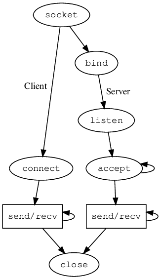

# Code Walkthrough



## Blocking write

`packetdrill/gtests/net/tcp/blocking/blocking-write.pkt`

```c
// Test for blocking write.
--tolerance_usecs=10000

`../common/defaults.sh
 ../common/set_sysctls.py /proc/sys/net/ipv4/tcp_min_tso_segs=10
`

// Establish a connection.
    0 socket(..., SOCK_STREAM,PROTO_TCP) = 3
   +0 setsockopt(3, SOL_SOCKET, SO_REUSEADDR, [1], 4) = 0
   +0 bind(3, ..., ...) = 0
   +0 listen(3, 1) = 0

  +.1 < S 0:0(0) win 50000 <mss 1000,nop,wscale 0>
   +0 > S. 0:0(0) ack 1 <mss 1460,nop,wscale 8>
  +.1 < . 1:1(0) ack 1 win 50000
   +0 accept(3, ..., ...) = 4

// Kernel doubles our value -> sk->sk_sndbuf is set to 42000
   +0 setsockopt(4, SOL_SOCKET, SO_SNDBUF,  [21000], 4) = 0
   +0 getsockopt(4, SOL_SOCKET, SO_SNDBUF,  [42000], [4]) = 0

// A write of 60000 does not block.
   +0...0.300 write(4, ..., 61000) = 61000    // this write() blocks

  +.1 < . 1:1(0) ack 10001 win 50000

  +.1 < . 1:1(0) ack 30001 win 50000

// This ACK should wakeup the write(). An ACK of 35001 does not.
  +.1 < . 1:1(0) ack 36001 win 50000

// Reset to sysctls defaults.
`/tmp/sysctl_restore_${PPID}.sh`
```

`tcpdump -i any -n -ttt tcp port 8080`
```c
// Three-way handshake
1 0.000000 remote:54321 > local:8080: [S], seq 0, win 50000, options [mss 1000,nop,wscale 0], length 0
2 0.000640 local:8080 > remote:54321: [S.], seq 12345, ack 1, win 65535, options [mss 1460,nop,wscale 8], length 0
3 0.111259 remote:54321 > local:8080: [.], ack 1, win 50000, length 0

// cwnd = 10, mss = 1000, so send 10 * 1000 then wait for ACK.
4 0.017588 local:8080 > remote:54321: [P.], seq 1:5001, ack 1, win 256, length 5000
5 0.000199 local:8080 > remote:54321: [P.], seq 5001:10001, ack 1, win 256, length 5000
6 0.101236 remote:54321 > local:8080: [.], ack 10001, win 50000, length 0

// slow-start, increase cwnd per ACK. cwnd = 20, so send 20 * 1000 then wait for ACK.
7 0.000573 local:8080 > remote:54321: [P.], seq 10001:20001, ack 1, win 256, length 10000
8 0.000276 local:8080 > remote:54321: [P.], seq 20001:30001, ack 1, win 256, length 10000
9 0.099876 remote:54321 > local:8080: [.], ack 30001, win 50000, length 0

// slow-start, again. write() now blocks.
10 0.000490 local:8080 > remote:54321: [P.], seq 30001:35001, ack 1, win 256, length 5000
11 0.000456 local:8080 > remote:54321: [P.], seq 35001:45001, ack 1, win 256, length 10000
12 0.000182 local:8080 > remote:54321: [P.], seq 45001:55001, ack 1, win 256, length 10000
13 0.000157 local:8080 > remote:54321: [P.], seq 55001:60001, ack 1, win 256, length 5000
14 0.098661 remote:54321 > local:8080: [.], ack 36001, win 50000, length 0

// the previous ACK unblocks write().
15 0.001139 local:8080 > remote:54321: [P.], seq 60001:61001, ack 1, win 256, length 1000
16 0.325737 local:8080 > remote:54321: [.], seq 36001:37001, ack 1, win 256, length 1000  // Re-xmit
17 0.038498 local:8080 > remote:54321: [F.], seq 61001, ack 1, win 256, length 0
```

Call trace of SYN, SYNACK
```text
IPv4
ip_local_deliver_finish -> ip_protocol_deliver_rcu -> tcp_v4_rcv -> tcp_v4_do_rcv
    -> tcp_rcv_state_process -> tcp_v4_conn_request -> tcp_conn_request -> tcp_v4_send_synack
    -> ip_output

IPv6
ip6_input -> ip6_input_finish -> ip6_protocol_deliver_rcu -> tcp_v6_rcv -> tcp_v6_do_rcv
    -> tcp_rcv_state_process -> tcp_v6_conn_request -> tcp_conn_request -> tcp_v6_send_synack
    -> ip6_xmit -> dst_output -> ip6_output
```


Call trace of `write(2)`
```text
entry_SYSCALL_64 -> do_syscall_64 -> ksys_write -> vfs_write -> new_sync_write -> call_write_iter
    -> sock_write_iter -> sock_sendmsg -> sock_sendmsg_nosec -> tcp_sendmsg -> tcp_sendmsg_locked
    -> tcp_push -> __tcp_push_pending_frames -> tcp_write_xmit -> tcp_transmit_skb
    -> __tcp_transmit_skb -> ip_queue_xmit -> __ip_queue_xmit -> ip_local_out -> dst_output
    -> ip_output

IPv6
__tcp_transmit_skb -> inet6_csk_xmit -> ip6_xmit -> dst_output -> ip6_output
```

Call trace of receiving ACK from packet 6
```text
ip_local_deliver_finish -> ip_protocol_deliver_rcu -> tcp_v4_rcv -> tcp_v4_do_rcv
    -> tcp_rcv_established -> tcp_data_snd_check -> tcp_push_pending_frames
    -> __tcp_push_pending_frames -> ...
```

Call trace of `close(2)`
```text
__fput -> sock_close -> __sock_release -> inet_release -> tcp_close -> tcp_send_fin
    -> __tcp_push_pending_frames -> tcp_write_xmit -> tcp_transmit_skb -> ...
```
